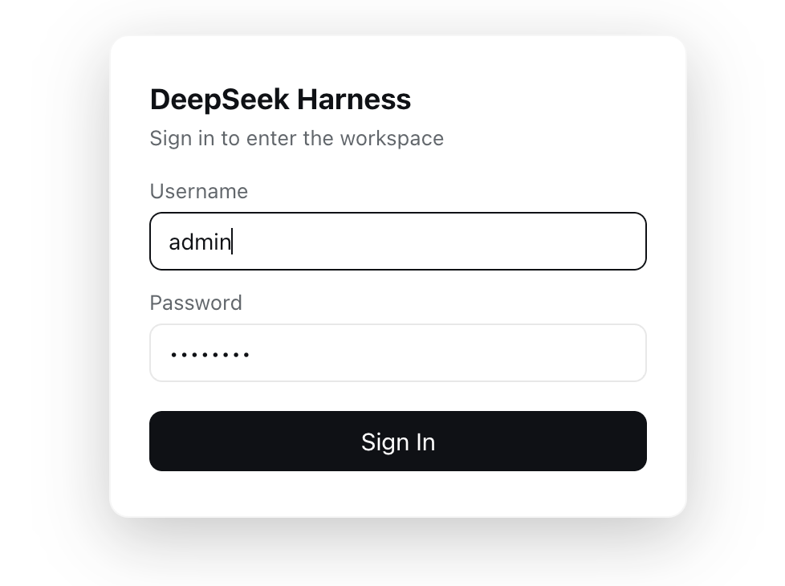

# DeepSeek Harness Login Gate Plugin (auth-gate)

[简体中文](README.md) | **English**

A plugin bundle that adds a login gate and account management to the DeepSeek Harness web UI.

## Preview



## Features

- **Login gate**: a full-screen login page covers the whole app until you sign in; nothing is operable without a session.
- **Account settings**: a new "Account Settings" page in the system settings for changing the username and password.
- **Log out**: red "Log out" buttons in the settings header and on the account settings page; clicking returns to the login page immediately (logs the account out only, never the app).
- **Multi-language**: follows the DeepSeek Harness UI language automatically (Settings → Appearance → Language), supporting Chinese and English.
- **Secure storage**: the password is persisted locally as a salted scrypt hash — plaintext is never stored.
- **Persistent**: account and password changes survive app restarts (default account `admin` / password `admin123`).

## Installation

Install the plugin as a bundle in your DeepSeek Harness user profile:

1. Put the `dsh-login-gate` directory (this repository's contents) into the profile's bundles directory, e.g.:
   `~/.dsh/profiles/web/bundles/auth-gate/`
2. Add the bundle reference to the profile's `package.json`:

   ```json
   {
     "dsh": {
       "profile": {
         "bundles": [
           "@dsh-login-gate/auth-gate"
         ]
       }
     },
     "dependencies": {
       "@dsh-login-gate/auth-gate": "link:./bundles/auth-gate"
     }
   }
   ```

3. Run `pnpm install` in the profile directory to create the link.
4. Restart the DeepSeek Harness app.

## Structure

```
dsh/
  index.js           Host side: HTTP routes (login/status/logout/update)
  account-store.js   Host side: scrypt hashing + local persistent storage
  client.js          Browser side: login gate + account settings page (lazy-CJS bundle)
cordis.patch.yml     Plugin mounting config
package.json         Package declaration (dsh.bundle / dsh.client)
```

## Data file

Account data is stored in `<profile directory>/login-gate-accounts.json`:

```json
{
  "username": "admin",
  "password": "scrypt$16384$8$1$<salt>$<hash>",
  "sessionToken": null
}
```

## API

| Method | Path | Description |
| --- | --- | --- |
| GET | `/login-gate/status?token=...` | Validate a session |
| POST | `/login-gate/login` | Sign in, returns a token |
| POST | `/login-gate/logout` | Log out, clears the session |
| POST | `/login-gate/update` | Change username/password (requires the current password) |

## License

[MIT](LICENSE)
