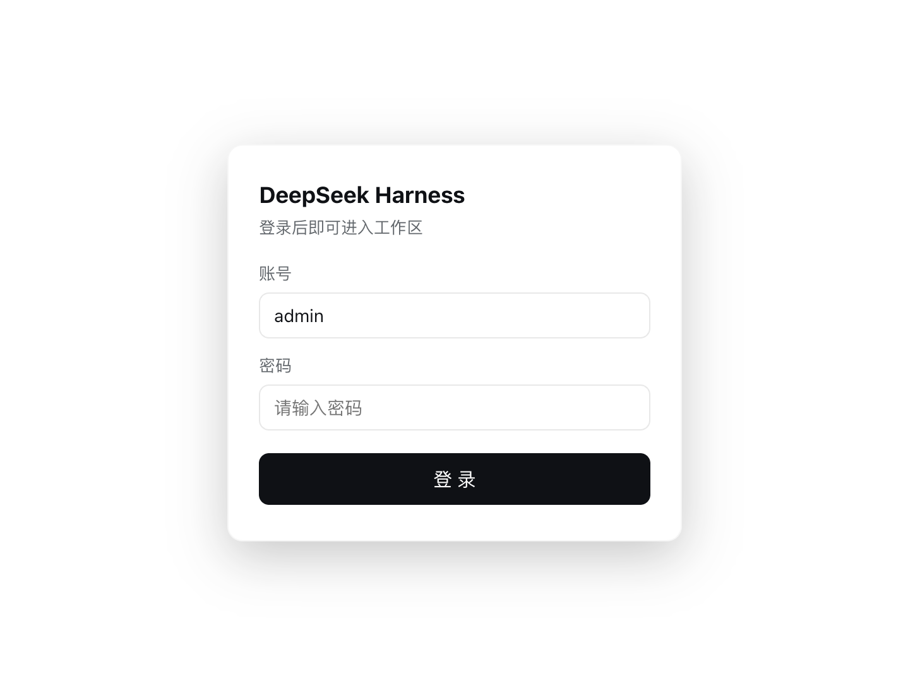

# DeepSeek Harness 登录门禁插件 (auth-gate)

一个为 DeepSeek Harness Web 界面提供登录门禁 + 账号管理的插件 bundle。

## 预览



## 功能

- **登录门禁**：未登录时全屏登录页覆盖整个应用，无法操作任何功能。
- **账号设置**：系统设置里新增「账号设置」页面，可修改账号名和密码。
- **退出登录**：设置页头部和账号设置页均有红色「退出登录」按钮，点击后立即切回登录页（只退出账号，不影响应用）。
- **安全存储**：密码以加盐 scrypt 哈希持久化到本地文件，绝不保存明文。
- **持久化**：账号、密码修改重启应用后依然保留（默认账号 `admin` / 密码 `admin123`）。

## 安装

本插件作为 DeepSeek Harness 用户 profile 的 bundle 安装：

1. 将 `dsh-login-gate` 目录（本仓库内容）放入 profile 的 bundles 目录，例如：
   `~/.dsh/profiles/web/bundles/auth-gate/`
2. 在 profile 的 `package.json` 中添加 bundle 引用：

   ```json
   {
     "dsh": {
       "profile": {
         "bundles": [
           "@dsh-login-gate/auth-gate"
         ]
       }
     },
     "dependencies": {
       "@dsh-login-gate/auth-gate": "link:./bundles/auth-gate"
     }
   }
   ```

3. 在 profile 目录执行 `pnpm install` 建立链接。
4. 重启 DeepSeek Harness 应用。

## 结构

```
dsh/
  index.js           Host 端：HTTP 路由（登录/状态/退出/改密）
  account-store.js   Host 端：scrypt 哈希 + 本地持久化存储
  client.js          浏览器端：登录遮罩 + 账号设置页（lazy-CJS bundle）
cordis.patch.yml     插件装载配置
package.json         包声明（dsh.bundle / dsh.client）
```

## 数据文件

账号数据保存在 `<profile 目录>/login-gate-accounts.json`：

```json
{
  "username": "admin",
  "password": "scrypt$16384$8$1$<salt>$<hash>",
  "sessionToken": null
}
```

## 接口

| 方法 | 路径 | 说明 |
| --- | --- | --- |
| GET | `/login-gate/status?token=...` | 校验会话 |
| POST | `/login-gate/login` | 登录，返回 token |
| POST | `/login-gate/logout` | 退出登录，清空会话 |
| POST | `/login-gate/update` | 修改账号名/密码（需当前密码） |

## 许可证

[MIT](LICENSE)
